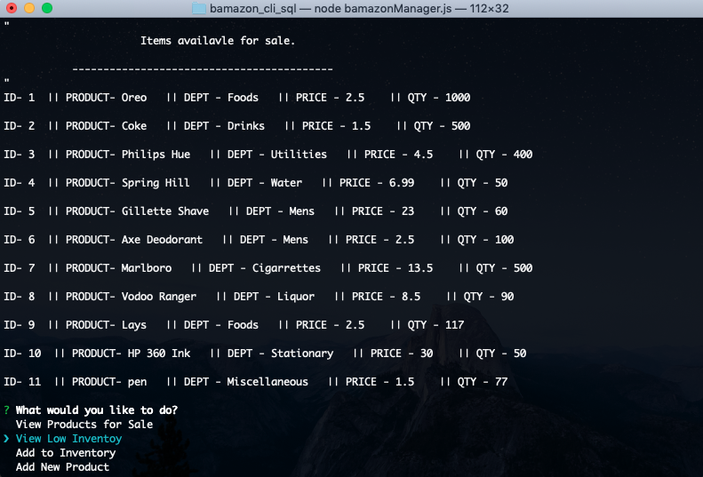
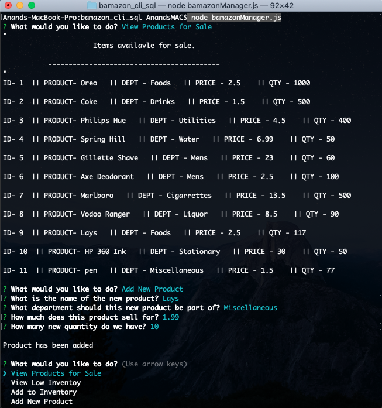
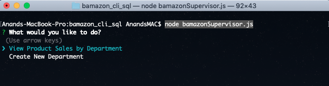
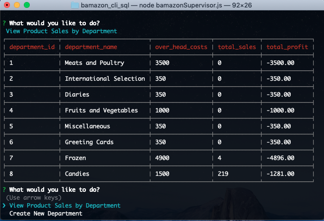
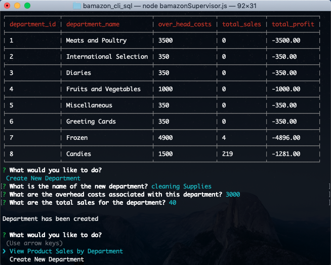

## bamazon

#Description

 Bamazon is a Node.js Command-Line-Interface application that takes in orders from the customers and depletes stock from the store's inventory. The application implements inquirer NPM package and MySQL database backened by MySQL NPM package to make the app functional.

**Before you begin** 
**Node** is required to run this application. [download node.js](https://nodejs.org/en/download/) 

1. Clone the repository.
2. Install inquirer NPM by typing [npm install inquirer](https://www.npmjs.com/package/inquirer) on your terminal/bash
3. Install MySQL NPM by typing [npm install mysql](https://www.npmjs.com/package/mysql) on your terminal/bash

# How the app works? How to use the app?

The application has three different functional modules:

 1. **Customer's View** - This modules displays the list of the products available for purchase. It then prompts the user to make a selection  by product ID followed by the quantity. Once the customer has placed the order, the application checks the store if it has sufficient quantity to fulfill the customer's order and display's the total purchase cost, should the order criteria be fulfilled.
 
 2. **Manager's View** - This module is is designed to manage, view or manipulate the store's inventory. The application in this module allows the user to:
 a) view the product for sale
 b) View low Inventory(count less than 5)
 c) Add to inventory
 d) Add new product

 
 

3. **Supervisor's View**- This module allows the user to create a new Department and view the product sales by department and see the product sales, overhead costs and total profit.

